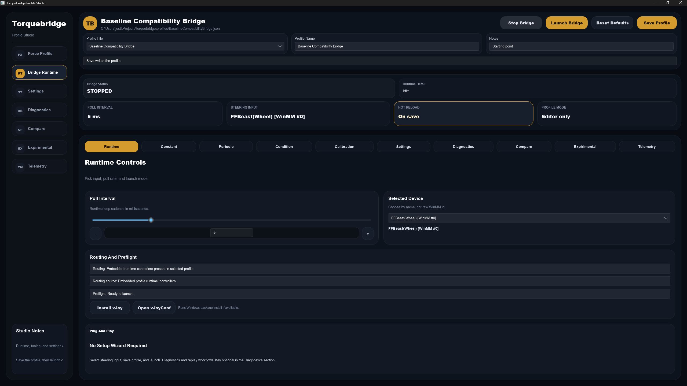
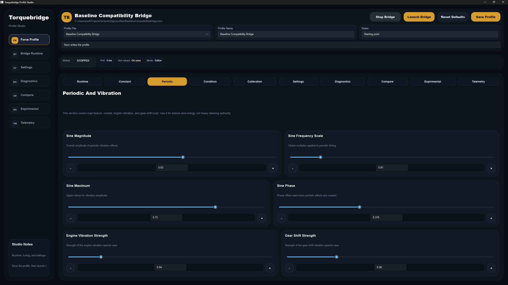
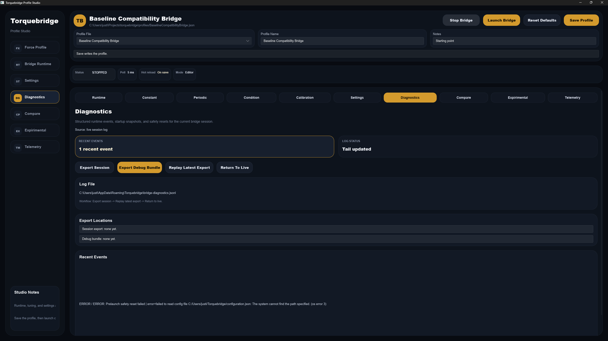
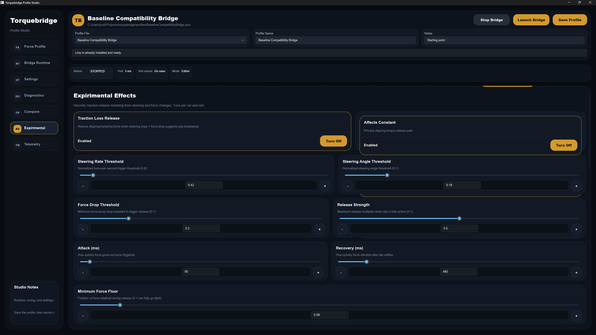
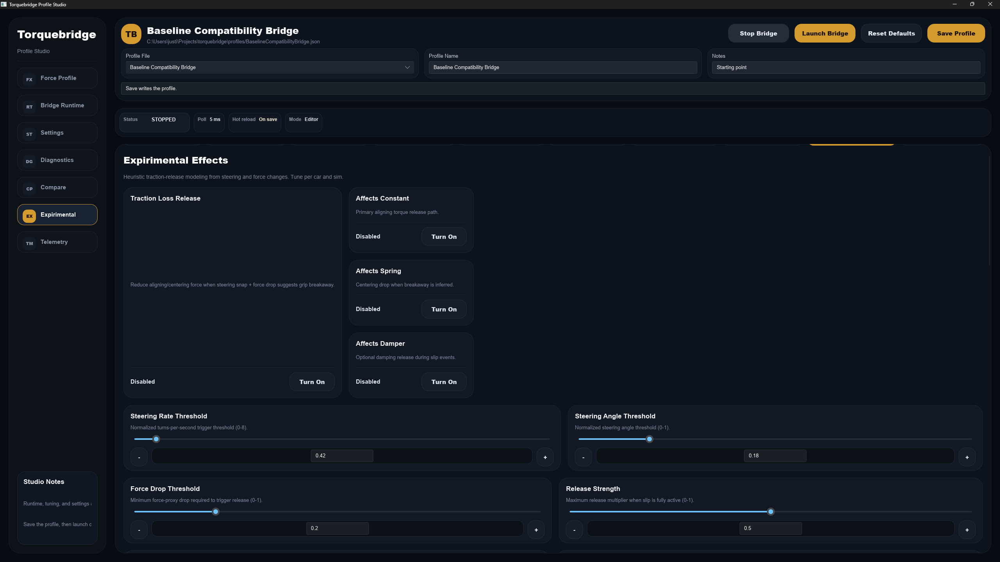
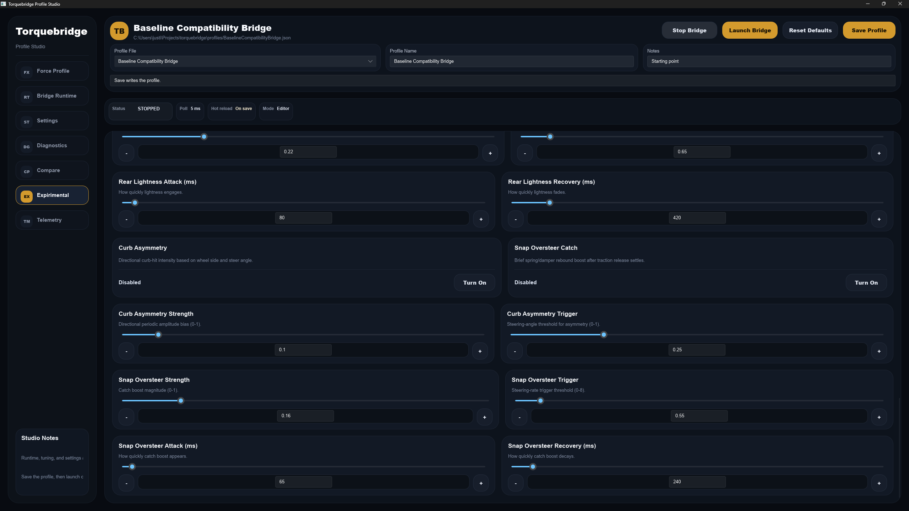
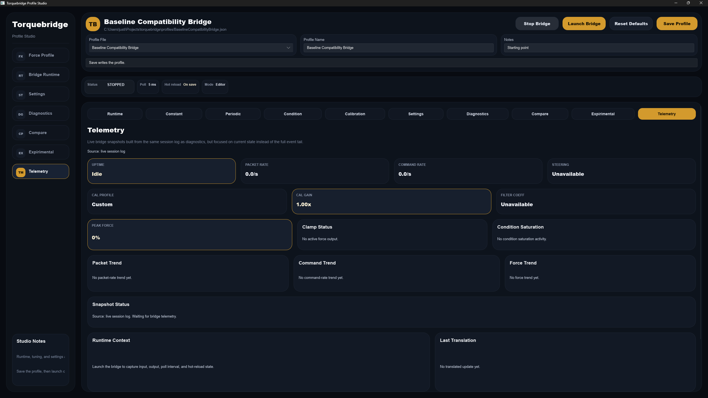

# Torquebridge

Torquebridge makes it easier to play Forza with an FFBeast wheel by giving you a clean, profile-based force feedback workflow.

Double-click the app to open Profile Studio, then tune and launch from there.

You can launch quickly with sensible defaults, then tune exactly how the wheel feels for your setup without fighting complex configuration files every session.

## Why Torquebridge

- Faster setup for Forza sessions with FFBeast hardware.
- One place to tune wheel feel instead of scattered tools.
- Save multiple profiles for different cars, setups, or driving styles.
- Optional advanced controls when you want more detail.
- Built-in diagnostics when something feels off.

## What You Can Customize

- Core force feel
  - Constant force
  - Periodic and vibration behavior
  - Condition effects (spring and damper)
- Calibration controls
  - Output and per-effect gain
  - Steering center, range, and curve
- Experimental effects
  - Traction loss release behavior
  - Inferred dynamics toggles and thresholds

## Quick Start For Players

1. Open Profile Studio. If you launched the EXE normally, this should already be open.
2. Pick your steering device in the Runtime tab.
3. Save your profile.
4. Launch bridge.
5. Drive in Forza and tune from the tabs as needed.

Tip: Use Reset Defaults any time you want to get back to a clean baseline and retune from scratch.

## Daily Use Flow

1. Select the profile you want to use.
2. Confirm your steering input in Runtime.
3. Launch bridge.
4. Make small changes while testing in-game.
5. Save profile when it feels right.

## Troubleshooting (Player-Focused)

- If launch is blocked by vJoy
  - Use Install vJoy in Runtime.
  - Use Open vJoyConf and enable/configure device 1.
- If the wheel feel is too heavy or too weak
  - Start with Calibration output gain.
  - Then adjust per-effect values in Constant, Periodic, and Condition tabs.
- If things get messy while tuning
  - Use Reset Defaults, then reapply only the changes you want.

## Screenshots

### Main Screen

### Periodic And Vibration Panel

### Diagnostics

### Experimental

### Experimental 2

### Experimental 3

### Telemetry

---

## Developer / Contributing / Technical

This section is for contributors and maintainers.

### Build And Run

- Requirements
  - Windows
  - Rust stable toolchain
  - vJoy installed/configured for runtime testing
- Run UI
  - cargo run -- ui
- Run tests
  - cargo test

### Repository Areas

- src: runtime loop, translation engine, hardware integration
- ui: Slint UI layout and controls
- profiles: profile seeds and tuning data
- docs: roadmap and architecture notes

### Contribution Notes

- Keep user-facing flow profile-first and plug-and-play.
- Avoid adding setup complexity to basic runtime use.
- Keep experimental features disabled by default unless explicitly enabled in profile data.
